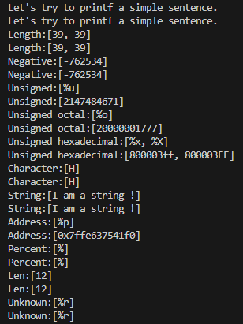

### *Description:* 
The _printf function is a standard function in the C language, used to display information on the terminal.

### *Format specifiers:*

**%d** and **%i**: Displays an integer.

**%c**: Displays a character.

**%s**: Displays a string of characters.

**%%**: Displays a **%** symbol. 

### *Usage examples:*  
#### Integer

Input: _printf("The concert starts in %d min.", 20);

Output: The concert starts in 20 min.

#### Character

Input: _printf("Display a character: %c", 'A');

Output: Display a character: A

#### String

Input: _printf("%s", "This is our first project.");

Output: This is our first project.

### *Internal functioning:*

The _printf function begins by analyzing the character string. This string can contain normal characters (letters, spaces, symbols) as well as format specifiers (like %s, %d, %c, etc.).

 Normal characters: Characters not preceded by the % symbol are printed directly.
 Format specifiers: When a % is encountered, it indicates that a format specifier follows, and the appropriate argument should be printed in its place.

### *Cloning the project via Github:*
#### Address of the _printf project:
https://github.com/Mattieuuu/holbertonschool-printf

Files included in the project:
- **main.h**: Declaration of function prototypes and creation of a structure.

- **main.c**: File for using printf.

- **Function_setting.c**: Variadic function to handle format specifiers. Initialization of functions (_printf, handle_spe, print_str, print_perc, print_char)

- **Function.c**: Initialization of functions (print_int, print_num, _putchar)

### *Compilation:*

gcc -Wall -Wextra -Werror -pedantic -std=gnu89 -Wno-format *.c -o printf.c

#### Explanation of compilation options:
- **gcc**: C language compiler.

- **-Wall**: Activates all compiler warnings.

- **-Wextra**: Activates additional warnings to avoid potential errors.

- **-Werror**: Treats warnings as errors, forcing you to correct them before compiling.

- **-pedantic**: Strict checker for C language standards.

- **-std=gnu89**: Tells the compiler which version to use for compilation.

- **-Wno-format**: Disables warnings related to misuse of format specifiers.

- ***.c**: The project source files that will be compiled together.

- **-o printf.c**: Makes the compilation executable via the printf.c file.

### Testing the printf function:
Tested with Ubuntu 22.04.

### *Auteur :*

The printf project was developped by :

==> **[Mattieu MOUROUX](https://github.com/Mattieuuu)** -Developement of function '_printf', developement of README.md (traductor), developement of flowchart

==> **[Aurélien GOAOC](https://github.com/Aurelien292)** -Developement of function '_printf' , documentation of README.md, developement of flowchart, developement of the man page

